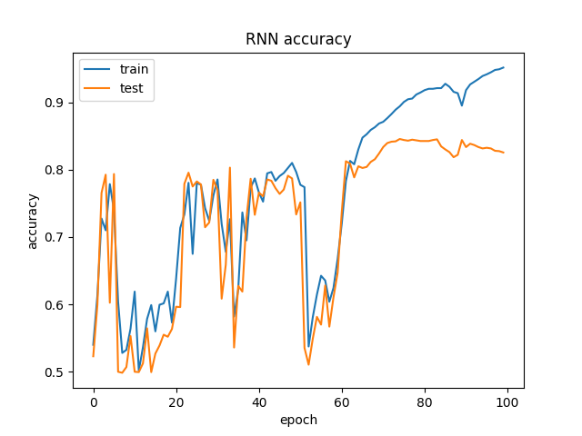
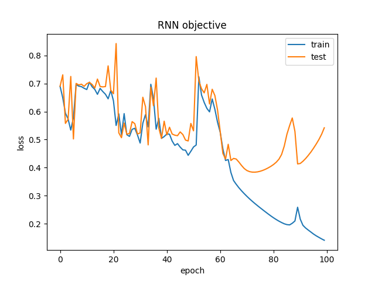

# GIST coding interview

*Implementation conduct comparision between CNN and RNN based model on text classification task, the effectiveness of pretraining embeding.*

## Installation
Easily to running on Google Colab without install extra package

```shell
$ git clone https://github.com/tiennvcs/GIST_coding_interview/

$ cd GIST_coding_interview/

$ pip install -r requirements.txt
```

[Colab notebook](https://colab.research.google.com/drive/1IgNh7-S3yUTl6Z06XKMwriDoGkIxFxF3?usp=sharing)

## Usages
Run file `./statistic_data.py` to get the counting information of data. For example, if you want to statistic folder `./data/train/`, just run the following commands.

```shell
$ python statistic_data.py --input_dir ./data/train/
```

Train model with different arguments
```shell
$ python train.py -h

optional arguments:
  -h, --help            show this help message and exit
  --data_dir DATA_DIR   The training data directory path
  --model MODEL         The using model
  --pretrain_embedding PRETRAIN_EMBEDDING
                        The pretrain embedding
  --num_words NUM_WORDS
                        Maximum number of features
  --feature_dim FEATURE_DIM
                        Maximum number of features
  --test_size TEST_SIZE
                        The test size for spliting dataset
  --epochs EPOCHS       The number of epochs in training progress
  --batch_size BATCH_SIZE
                        The batch size using in training progress
  --optimizer {sgd,adam,rmsprop}
                        The optimization algorithm using in training
  --learning_rate LEARNING_RATE
                        The learning rate of model
  --work_dir WORK_DIR   The working directory to store model and training log
```

For example, run the following command to train RNN model on `./data` with  10k num_words, 100 feature dim, learning rate 1e-3, 100 epochs, 64 batch sizes, Adam optimizer and store model in `runs/train/` 
```shell
$python train.py --data_dir ./data --model RNN \
    --pretrain_embedding data/all.review.vec.txt \
    --num_words 10000 --feature_dim 100 \
    --learning_rate 1e-3 --optimizer adam \
    --epochs 100 --batch_size 64 
    --work_dir ./runs/train/RNN_64_Adam_1e3_Adam_w/
```

## Experiment and results

Check at [here](https://docs.google.com/spreadsheets/d/1zMhq6dC8P9bYwVvvTH5BwUhH2-9rylmUHx7rHulbmpY/edit?usp=sharing)

Some training plots

Accuracy plot of RNN_64_Adam_1e3_Adam_w            |  Objective plot of RNN_64_Adam_1e3_Adam_w
:-------------------------:|:-------------------------:
  |  

---
Contact information: tiennvcs@gmail.com
